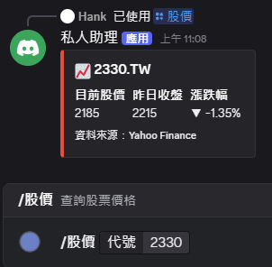

# Screenshots

這裡放 Discord Bot 互動的截圖，用於 README 展示。

## 建議截圖清單

### 必拍
- `demo.gif` - 完整 Demo（5-10 秒，連續展示幾個指令）
- `architecture.png` - 系統架構圖
- `command-list.png` - Discord 顯示的 Slash Command 自動補全清單

### 各功能展示（每個一張）
- `stock.png` - /股價 結果卡片
- 
- `weather.png` - /天氣 結果卡片
- `distance.png` - /距離 結果卡片
- `exchange.png` - /匯率 結果卡片（含金額換算）
- `news.png` - /新聞 AI 摘要結果
- `accounting.png` - /記帳 確認卡片
- `expense.png` - /支出 統計圖
- `todo-list.png` - /待辦列表（Barcode 版）
- `todo-text.png` - /待辦列表（純 ID 版）
- `reminder.png` - /提醒 設定 + 到期推播

### 後端展示
- `n8n-router.png` - n8n Router Workflow 全景
- `n8n-news.png` - 新聞 Workflow（複雜，含 AI）
- `cloudflare-worker.png` - Cloudflare Worker 介面

## 建議規格

- 解析度：1920x1080 或更高
- 格式：PNG（截圖）/ GIF（動畫）
- GIF 大小：壓縮到 2 MB 以下，避免 README 載入慢
